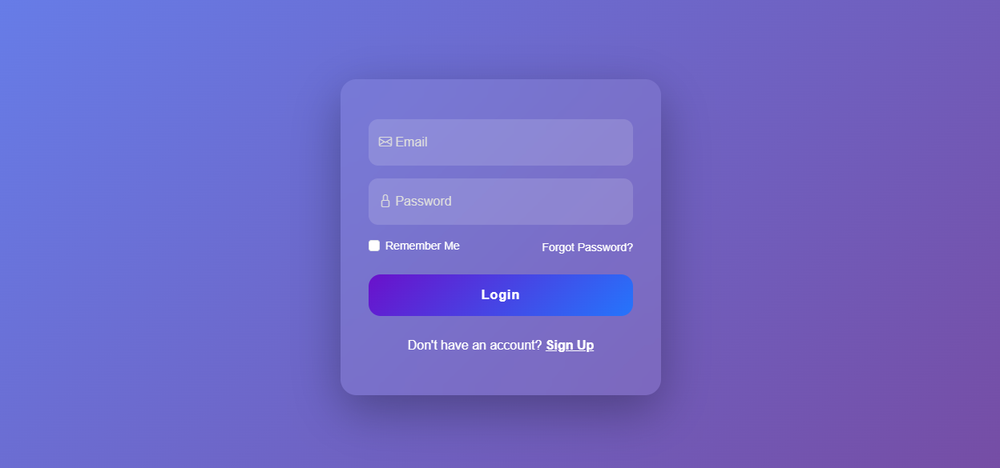
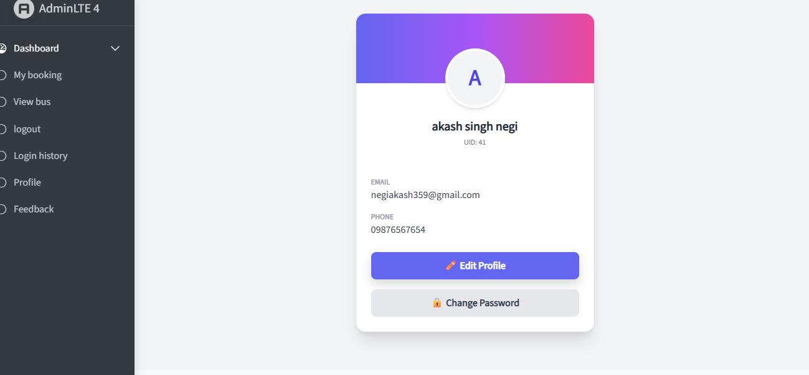
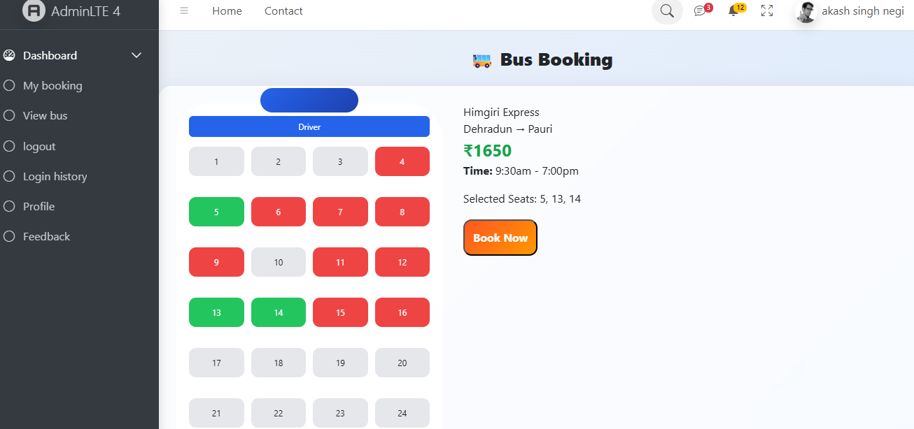
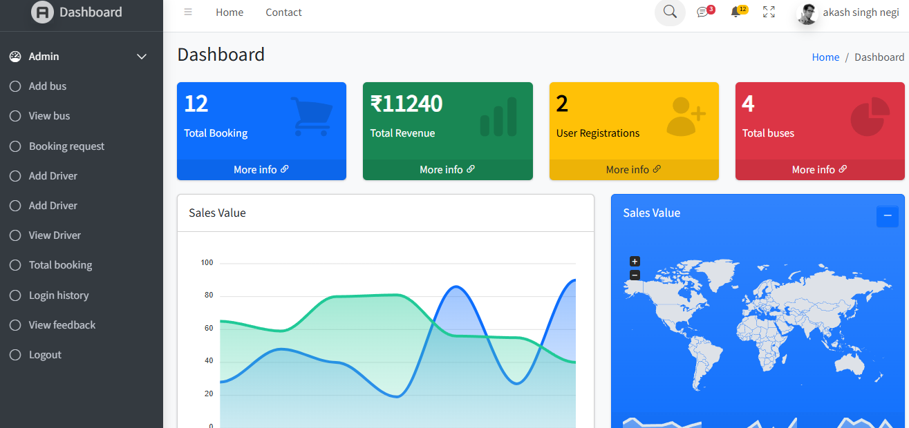

# 🚌 Bus Reservation Management System

A web-based Bus Reservation Management System designed to simplify online bus ticket booking and management. It has separate User and Admin panels for smooth operation.

---

## 🚀 Technologies Used
- HTML
- CSS
- JavaScript
- PHP
- MySQL

---

## ⭐ Features

### 👤 User Panel
- User Registration & Login  
- Forgot / Change Password  
- Browse Available Buses  
- Seat Selection System  
- Ticket Booking  
- Profile Management  
- Booking History  
- Feedback System  

### 🛠️ Admin Panel
- Admin Login  
- Manage Buses (Add/Edit/Delete)  
- Manage Drivers  
- View & Manage Bookings  
- Approve / Reject Tickets  
- View Feedback  

---

## 📸 Screenshots

### Login Page

### User Dashboard

### Seat Selection

### Admin Dashboard

---

## 🎯 Highlights
- Role-based access (Admin/User)  
- Responsive UI  
- Real-time booking system  
- Secure authentication  
- Easy navigation  

---

## 👨‍💻 Author
Akash Singh  
GitHub: https://github.com/Akash-831
